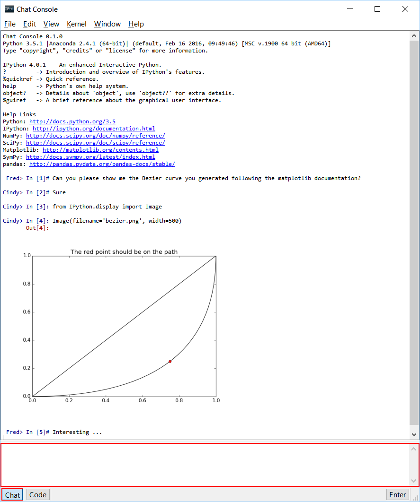

# Chat Console

Chat Console is a command console (shell) for Jupyter kernels, with enhancements for inline graphics,
syntax highlighting, and much more.
It facilitates collaborative
work by supporting chat and displaying commands of multiple users asynchronously.

## Install Chat Console

The Chat Console requires Qt, such as
[PyQt5](http://www.riverbankcomputing.com/software/pyqt/intro),
[PyQt4](https://www.riverbankcomputing.com/software/pyqt/download),
or [PySide](http://pyside.github.io/docs/pyside).

Although [pip](https://pypi.python.org/pypi/pip) and
[conda](http://conda.pydata.org/docs) may be used to install the console, conda
is simpler to use since it automatically installs PyQt. Alternatively,
the console installation with pip needs additional steps since pip cannot install
the requirement.

### Install using conda
To install:

    conda install chconsole

**Note:** If the console is installed using conda, it will **automatically**
install the Qt requirement as well.

### Install using pip
To install:

    pip install chconsole

**Note:** Make sure that Qt is installed. Unfortunately, Qt cannot be
installed using pip. The next section gives instructions on installing Qt.

### Installing Qt (if needed)
We recommend installing PyQt with [conda](http://conda.pydata.org/docs):

    conda install pyqt

or with a system package manager. For Windows, PyQt binary packages may be
used.

## Usage
To run the Chat Console:

    jupyter chconsole

To start an IPython kernel to which Chat Console may be connected:

    chc-python

## Resources
- Documentation for the Chat Console
  * [latest version](http://chconsole.readthedocs.org/en/latest/)
  [[PDF](https://media.readthedocs.org/pdf/chconsole/latest/chconsole.pdf)]
  * [stable version](http://chconsole.readthedocs.org/en/stable/)
  [[PDF](https://media.readthedocs.org/pdf/chconsole/stable/chconsole.pdf)]
- [Project Jupyter website](https://jupyter.org)
- [Issues](https://github.com/jupyter/chconsole/issues)
